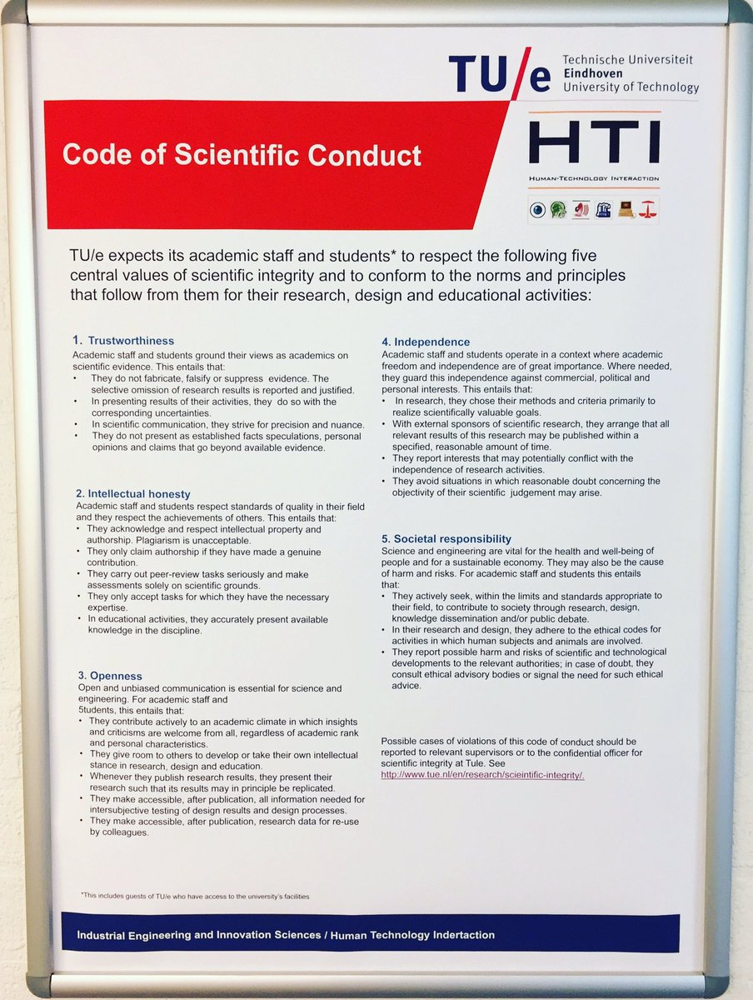

```{r setup, include=FALSE}
knitr::opts_chunk$set(echo = TRUE)
```

Poor quality research has led to a reproducibiity crisis

The current incentives aren't helping.

Low statistical power

## What's good for individual researchers

Current incentives in science can lead researchers to focus on:

* Citations
* High-prestige journals
* Hoarding data rather than sharing it

## What's good for science and its stakeholders

* Quality research
* Research that isn't p-hacked
<!--You can say that cheaters are gonna cheat regardless, but actually there are specific solutions, which I'll get to -->
* Reproducible research
* Data sharing for confirmation and re-use
* Open access

## Concrete improvements to science that currently aren't incentivised

* Preregistration, e.g. Registered Reports format
* Open data
* Open materials (e.g. analysis code, psychology rating scales)
* Open access

http://www.nature.com/news/faculty-promotion-must-assess-reproducibility-1.22596\

## Initiatives elsewhere to address this

[Opinion piece](http://www.nature.com/news/faculty-promotion-must-assess-reproducibility-1.22596) in Nature:
"We currently request that reviewers assess how a field would be different without a candidate’s contributions, and survey a candidate’s accomplishments, scholarship and recognition. We should also explicitly ask reviewers whether they can describe attempts to build on a candidate’s work and any controversies involved in doing so. Our processes should encourage evaluators to say whether they feel candidates’ work is problematic or overstated, and whether it has been reproduced and broadly accepted. If not, they should say whether they believe widespread reproducibility is likely, or whether the work will advance the field in some other way."


<!--From https://twitter.com/annemscheel/status/900383505972178944 -->

except from the Eindhoven code:

> 3. Openness
Open and unbiased communication is essential for science and engineering. For academic staff and
students, this entails that:
• They contribute actively to an academic climate in which insights and criticisms are welcome
from all, regardless of academic rank and personal characteristics.
• They give room to others to develop or take their own intellectual stance in research, design and
education.
• Whenever they publish research results, they present their research such that its results may in
principle be replicated.
• They make accessible, after publication, all information needed for intersubjective testing of
design results and design processes.
• They make accessible, after publication, research data for re-use by colleagues.


## Purpose of a statement endorsing research *quality*

A statement will do little by itself, but serves as a stake in the ground to push for initiatives that support quality research, e.g.:

  * Training on preregistration (necessary for p-values to be interpretable)
  * Open access support and APC funds
  * Training in statistical power analysis
  * Sharing of data analysis code
  

## Proposal

A statement endorsing research quality, with a brief preamble to motivate it. 

### Preamble

Certain metrics have become ingrained and applied to the evaluation of research outputs and researchers, such as number of citations and journal impact factor. In the absence of metrics that index the actual *quality* of research, the metrics used have created an imbalance in incentives that have contributed to poor reproducibility across several scientific fields.

### Statement

We should strive to make the research we conduct high quality and reproducible. Reproducible here means that others can easily reproduce the result, barring practical limitations. Facilitating reproducibility means:

* Not presenting p-hacked results as anything but exploratory
* Avoiding unconstrained degrees of freedom in data analysis using preregistration
* Sharing data analysis code, ideally by posting on the internet by the time a paper is published
* Sharing materials such as experiment code and questionnaires
* Open access publication, so there are no barriers to fact-mining by machines nor to access by businesses, nonprofits, and researchers around the world

